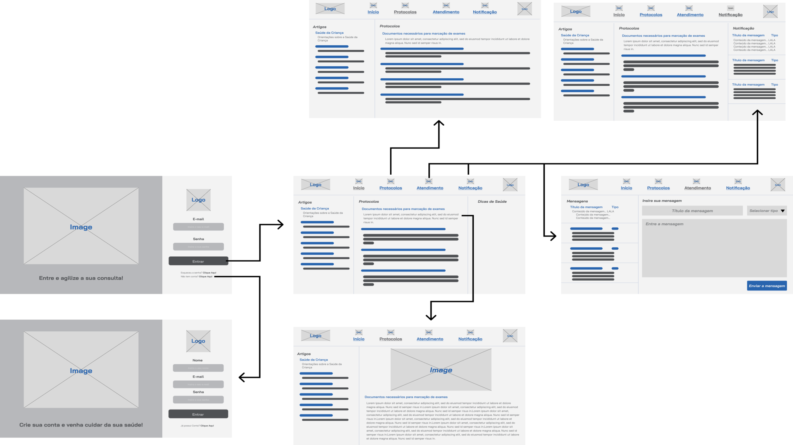

# Projeto de Interface

Visão geral da interação do usuário pelas telas do sistema e protótipo interativo das telas com as funcionalidades que fazem parte do sistema (wireframes).

 Apresente as principais interfaces da plataforma. Discuta como ela foi elaborada de forma a atender os requisitos funcionais, não funcionais e histórias de usuário abordados nas <a href="2-Especificação do Projeto.md"> Documentação de Especificação</a>.

## User Flow

Acima, temos as telas da nossa aplicação, que mapeiam o fluxo do usuário e incluem um total de 6 páginas alinhadas com os requisitos. Essa técnica permite ao desenvolvedor e aos membros da equipe visualizarem os caminhos e as possíveis ações que o usuário pode realizar.

## Wireframes

São protótipos usados em design de interface para sugerir a estrutura de um site web e seu relacionamentos entre suas páginas. Um wireframe web é uma ilustração semelhante do layout de elementos fundamentais na interface.

### Tela de Login
A tela de login é a primeira tela, onde os usuários podem inserir seu e-mail e senha. Há opções para ir para a HomePage (após a autenticação bem-sucedida) ou criar uma nova conta.
Importante para efetivação de requisitos funcionais como: 
\
RF-004: Acessar informações de agendamento para ajudar os pacientes; 
RF-005: Acessar e gerenciar seus calendários de consultas; 
RF-006: Agendamento por telefone, com assistente virtual.
\
Além dos requisitos de outras telas, visto que sem login, sem aplicação.
\
\

### Tela de Registro
A tela de login é a tela alternativa da Tela de Login, onde os usuários podem inserir seu nome, seu e-mail e senha. Há opções para ir para a HomePage (após a autenticação bem-sucedida) ou voltar para Tela de Login.
Como uma alternativa da Tela de Login, essa página carrega também os requisitos anteriores. 
Além dos requisitos de outras telas, visto que sem login, sem aplicação.

