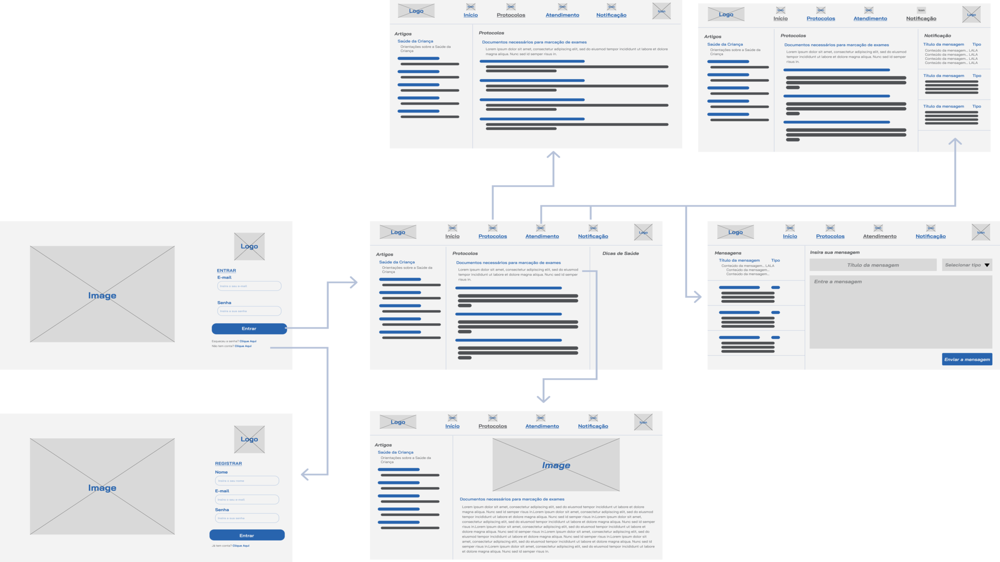
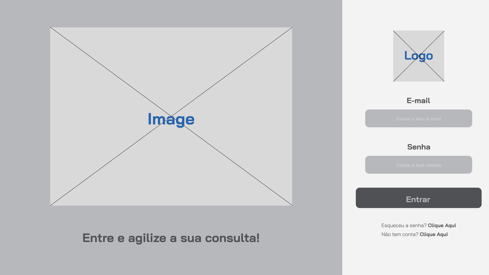
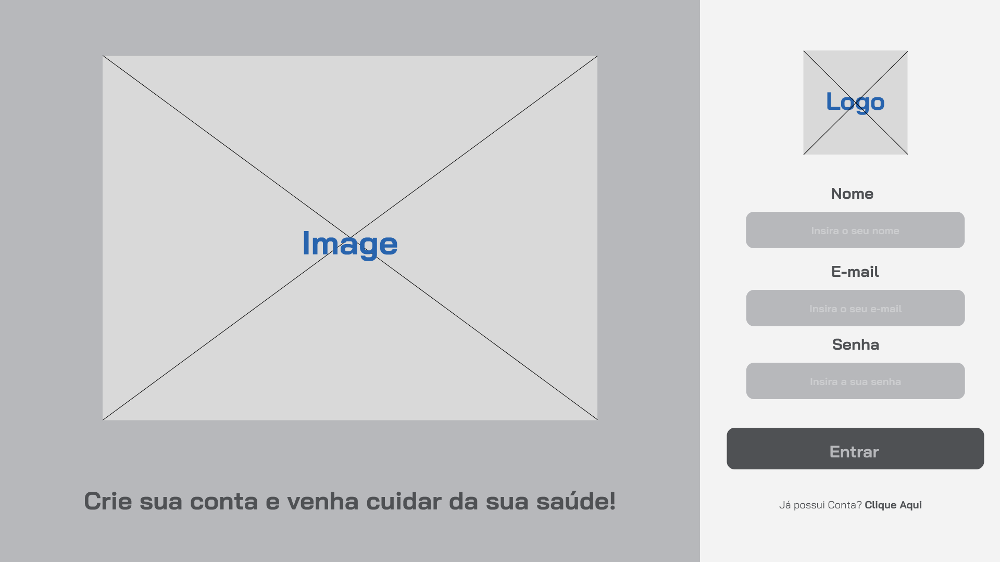
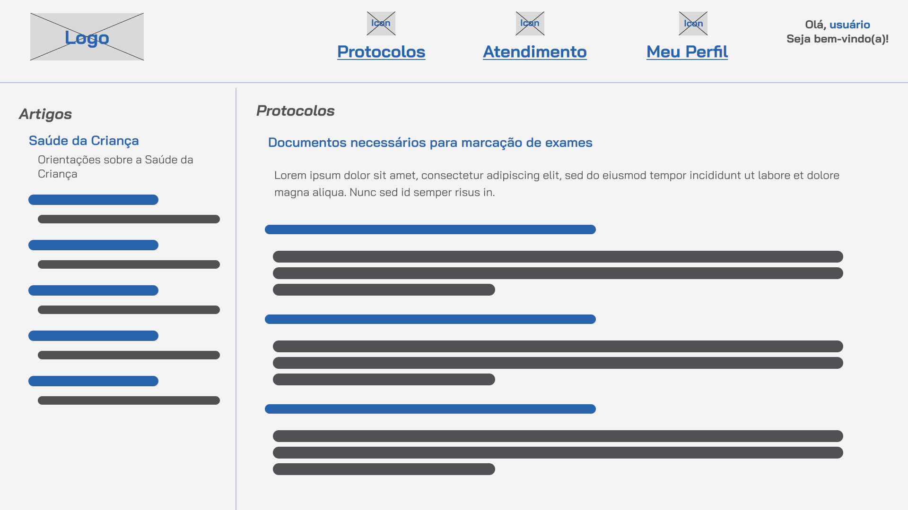
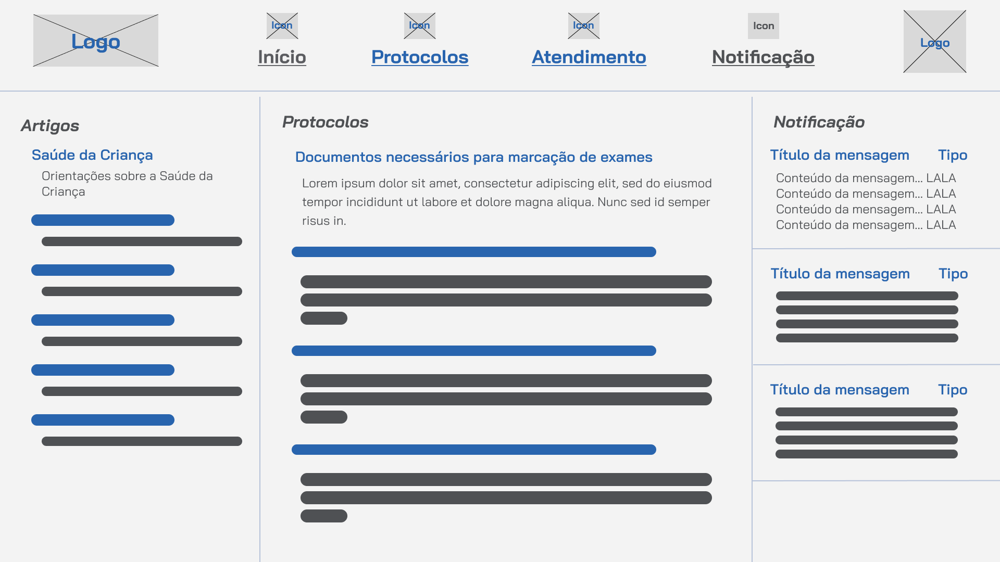
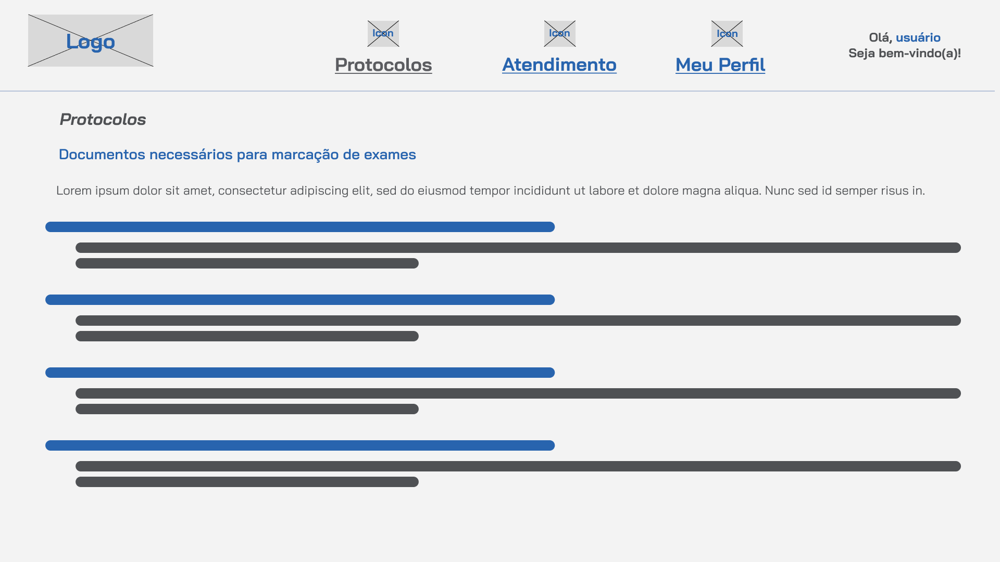
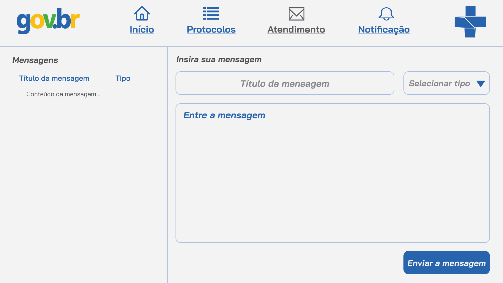

# Projeto de Interface

Visão geral da interação do usuário pelas telas do sistema e protótipo interativo das telas com as funcionalidades que fazem parte do sistema (wireframes).

 Apresente as principais interfaces da plataforma. Discuta como ela foi elaborada de forma a atender os requisitos funcionais, não funcionais e histórias de usuário abordados nas <a href="2-Especificação do Projeto.md"> Documentação de Especificação</a>.

## User Flow

Acima, temos as telas da nossa aplicação, que mapeiam o fluxo do usuário e incluem um total de 6 páginas alinhadas com os requisitos. Essa técnica permite ao desenvolvedor e aos membros da equipe visualizarem os caminhos e as possíveis ações que o usuário pode realizar.

## Wireframes

São protótipos usados em design de interface para sugerir a estrutura de um site web e seu relacionamentos entre suas páginas. Um wireframe web é uma ilustração semelhante do layout de elementos fundamentais na interface.

### Tela de Login
A tela de login é a primeira tela, onde os usuários podem inserir seu e-mail e senha. Há opções para ir para a HomePage (após a autenticação bem-sucedida) ou criar uma nova conta.
\
**Importante para efetivação de requisitos funcionais como:**
\
RF-004: Acessar informações de agendamento para ajudar os pacientes; 
\
RF-005: Acessar e gerenciar seus calendários de consultas; 
\
RF-006: Agendamento por telefone, com assistente virtual.
\
**Além dos requisitos de outras telas, visto que sem login, sem aplicação.**
\
\

### Tela de Registro
A tela de login é a tela alternativa da Tela de Login, onde os usuários podem inserir seu nome, seu e-mail e senha. 
\
Há opções para ir para a HomePage (após a autenticação bem-sucedida) ou voltar para Tela de Login.
\
Como uma alternativa da Tela de Login, essa página carrega também os requisitos anteriores.
\
**Além dos requisitos de outras telas, visto que sem login, sem aplicação.**
\

### Tela Principal
Essa é a Tela Principal do app, onde os usuários tem uma liberdade para onde a aplicação vai. 
\
No cabeçalho: Há opções de ir para a ProtocolosPage, tela dos protocolos; AtendimentoPage, tela de marcação de consulta e contato; NotificationButton, botão pelo qual abre uma aba de notificação.
\
Com isso no corpo da página, temos: Título e frase sobre ArtigoX (tela exterior da aplicação e leva para o artigo escolhido); Título e resumo de ProtocoloX (tela do protocolo escolhido);  OutroX, tela de outro; 
\
**Importante para efetivação de requisitos funcionais e não funcionais como:**
\
RNF-001: Interface deve ser intuitiva e fácil de usar para todas pessoas;
\
RF-003: Visualização das informações de protocolos;
\
RNF-005	O sistema deve ser acessível por meio de diferentes dispositivos, como computadores, smartphones e telefones;
\
**Esses requisitos são presentes quando botão de notificação é clicado**
RF-006	Agendamento por telefone, com assistente virtual para contato em geral;
\
RF-007	Os atendentes devem poder confirmar ou reagendar consultas conforme necessário;
\

\
Tela inicial com notificação clicado.
\

### Tela de Protocolos
Essa tela repete o cabeçalho da Tela Principal, mas temos uma visão mais ampla de Protocolos.
\
No corpo da página: Título e frase sobre ArtigoX (tela exterior da aplicação e leva para o artigo escolhido); Título e resumo de ProtocoloX (tela do protocolo escolhido).
\
**Importante para efetivação de requisitos funcionais e não funcionais como:**
\
RNF-001: Interface deve ser intuitiva e fácil de usar para todas pessoas;
\
RNF-005	O sistema deve ser acessível por meio de diferentes dispositivos, como computadores, smartphones e telefones;
\
RF-003: Visualização das informações de protocolos;
\

### Tela de Atendimento
Essa tela repete o cabeçalho da Tela Principal, mas temos uma visão para preencher uma mensagem.
\
No corpo da página: As mensagens já enviadas ou recebidas; Campo para inserir o título da mensagem; Campo de escolha para inserir o tipo de mensagem; Campo para inserir o corpo da mensagem; Botão para efetivar o envio.
\
**Importante para efetivação de requisitos funcionais e não funcionais como:**
\
RNF-001: Interface deve ser intuitiva e fácil de usar para todas pessoas;
\
RNF-005	O sistema deve ser acessível por meio de diferentes dispositivos, como computadores, smartphones e telefones;
\
RF-001	Permitir que pacientes agendem consultas com médicos de sua escolha;
\
RF-003: Visualização das informações de protocolos;
\
RF-008	Gerar uma confirmação de agendamento para o paciente.
\

