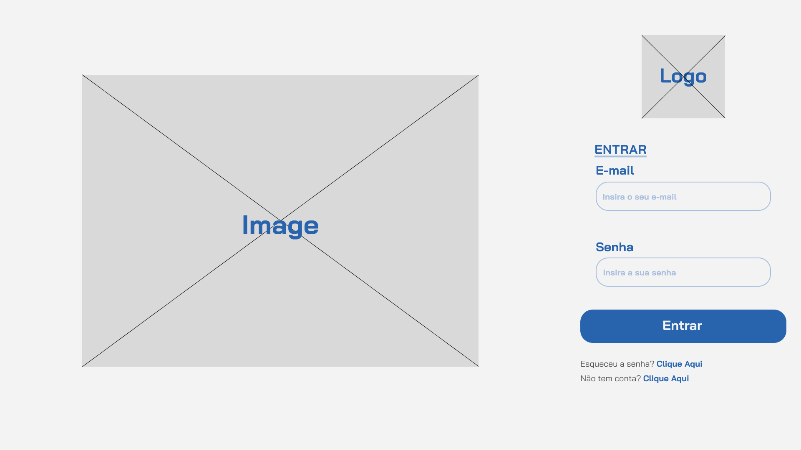
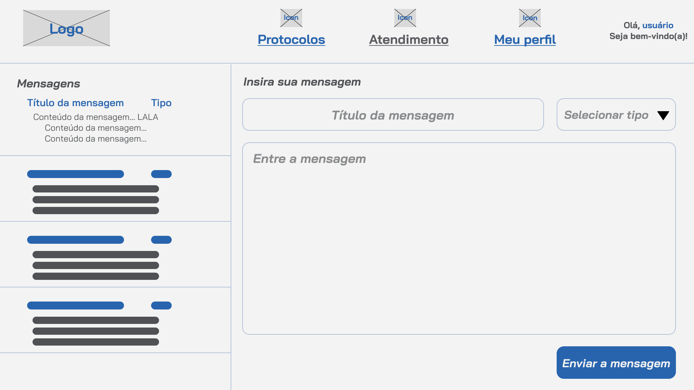

# Projeto de Interface
Visão geral da interação do usuário pelas telas do sistema e protótipo interativo das telas com as funcionalidades que fazem parte do sistema (wireframes).

## User Flow

Acima, temos as telas da nossa aplicação, que mapeiam o fluxo do usuário e incluem um total de 6 páginas alinhadas com os requisitos. Essa técnica permite ao desenvolvedor e aos membros da equipe visualizarem os caminhos e as possíveis ações que o usuário pode realizar.

## Wireframes

São protótipos usados em design de interface para sugerir a estrutura de um site web e seu relacionamentos entre suas páginas. Um wireframe web é uma ilustração semelhante do layout de elementos fundamentais na interface.

### Todas as Telas
**Todas as telas têm os seguintes requisitos não funcionais:**
\
RNF-001	Garantir que todas as telas sejam responsivas, ajustando-se automaticamente para proporcionar uma experiência de usuário otimizada em dispositivos desktop, tablet e mobile.
\
RNF-002	Garantir que todas as operações, como carregamento de páginas, pesquisa de protocolos e envio de mensagens, sejam executadas de forma rápida e eficiente, proporcionando uma experiência do usuário sem atrasos perceptíveis.
\
RNF-005	Manter uma interface do usuário intuitiva e fácil de usar, com navegação clara e elementos de design consistentes em todas as telas.
\
RNF-006	A plataforma de agendamento deve estar disponível 24/7 para os pacientes agendarem consultas a qualquer momento.
\

### Tela de Login
A tela de login é a primeira tela, onde os usuários podem inserir seu e-mail e senha. Há opções para ir para a HomePage (após a autenticação bem-sucedida) ou criar uma nova conta.
\
**Importante para efetivação de requisitos funcionais como:**

RF-002    | Permitir que um usuário já registrado, realize o login
\
**Além dos requisitos de outras telas, visto que sem login, sem aplicação.**
\

### Tela de Registro
A tela de registro é a tela alternativa da Tela de Login, onde os usuários podem inserir seu nome, seu e-mail e senha. 
\
Há opções para ir para a HomePage (após a autenticação bem-sucedida) ou voltar para Tela de Login.
\
RF-001	Permitir que os usuários preencham campos obrigatórios, como nome, e-mail e senha, para criar uma conta.
\
RNF-003	Garantir que as senhas dos usuários sejam armazenadas de forma segura, utilizando técnicas para proteger contra ataques de segurança.
\
**Além dos requisitos de outras telas, visto que sem login, sem aplicação.**
\

### Tela Principal
Essa é a Tela Principal do app, onde os usuários tem uma liberdade para onde a aplicação vai. 
\
No cabeçalho: Há opções de ir para a ProtocolosPage, tela dos protocolos; AtendimentoPage, tela de contato; Perfil, tela do perfil.
\
Com isso no corpo da página, temos: Título e frase sobre ArtigoX (tela exterior da aplicação e leva para o artigo escolhido); Título e resumo de ProtocoloX (tela do protocolo escolhido);
\
**Importante para efetivação de requisitos funcionais como:**
\
RF-003	Permitir que os usuários interajam com os artigos, protocolos na tela principal.
\
RF-005	Exibir lista de protocolos e permitir que os usuários cliquem em um protocolo para visualizar detalhes.
\
RF-006	Exibir lista de artigos e permitir que os usuários cliquem em um artigo para ser redirecionado para a notícia.

### Tela de Protocolos
Essa tela repete o cabeçalho da Tela Principal, mas temos uma visão mais ampla de Protocolos.
\
No corpo da página: Título e frase sobre ArtigoX (tela exterior da aplicação e leva para o artigo escolhido); Título e resumo de ProtocoloX (tela do protocolo escolhido).
\
**Importante para efetivação de requisitos funcionais como:**
\
RF-005: Exibir lista de protocolos e permitir que os usuários cliquem em um protocolo para visualizar detalhes.

### Tela de Atendimento
Essa tela repete o cabeçalho da Tela Principal, mas temos uma visão para preencher uma mensagem.
\
No corpo da página: As mensagens já enviadas; Campo para inserir o título da mensagem; Campo de escolha para inserir o tipo de mensagem; Campo para inserir o corpo da mensagem; Botão para efetivar o envio.
\
**Importante para efetivação de requisitos funcionais como:**
\
RF-007	Permitir que os usuários insiram mensagens com título, tipo e conteúdo relacionados ao atendimento.

### Tela de Perfil
Essa tela repete o cabeçalho da Tela Principal, mas temos uma visão para editar e visualizar os dados.
\
No corpo da página: Nome, Email, N de telefone, Cidade, inicialmente o Nome e Email ja estão registrados, e há um botão para completar os dados
\
**Importante para efetivação de requisitos funcionais como:**
\
RF-004	Permitir que os usuários visualizem suas informações e complete os dados

