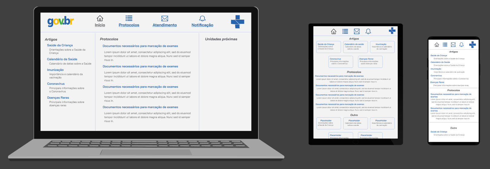
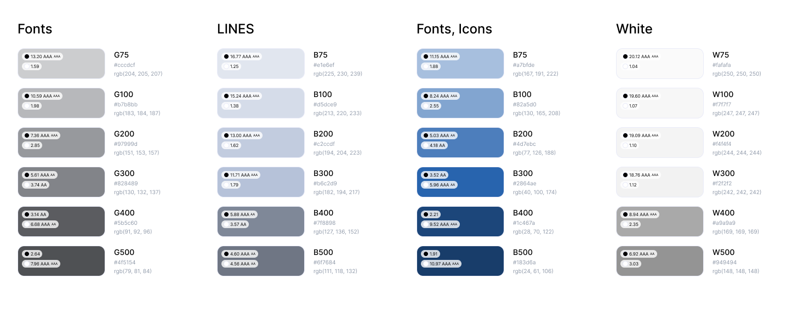

# Template padrão do site

### Aqui temos a Tela Principal

### Aqui temos a Tela de Login

Layout padrão do site (HTML e CSS) que será utilizado, pode ser visualizado em (src). Acima está as fotos pertinentes para visualização mais fácil.

## Cores

### Justificativa
A cor azul foi escolhida com base a cor da logo do SUS, e também, por conta de sua associação a dois conceitos fundamentais para a mensagem que desejamos transmitir em nosso site: **conforto e saúde**.
\
**Conforto:** O azul é universalmente reconhecido como uma cor que transmite uma sensação de tranquilidade e conforto. É uma cor que evoca uma sensação de calma e relaxamento, o que é essencial quando se trata de lidar com informações relacionadas à saúde e ao bem-estar.
\
\
**Saúde:** Além do aspecto emocional, o azul também está associado à saúde e à medicina em muitos contextos. É uma cor frequentemente usada por hospitais, clínicas e organizações de saúde para simbolizar a confiabilidade e a preocupação com o bem-estar dos pacientes.

### Paleta de cores

## Tipografia
### Fonte: Bai JamJuree

### Justificativa
Uma fonte moderna de fácil leitura que se mosotra muito limpa com o layout onde está inserida.

Hierarquia | Tamanho | Estilo | Cor
Título do tópico | 20px | Negrito & Itálico | #4F5154
Título do campo  | 18px | Negrito & Itálico | #2864AE
Paragráfo do campo | 16px | Normal | #4F5154

## Iconografia

Icones do GOV e SUS: São icones fixos atualmente sem funcionalidade.
Icones  respeitam a seguinte regra: Estático, cor #4F515; Icone da respectiva página: Ativo, cor #2864AE
