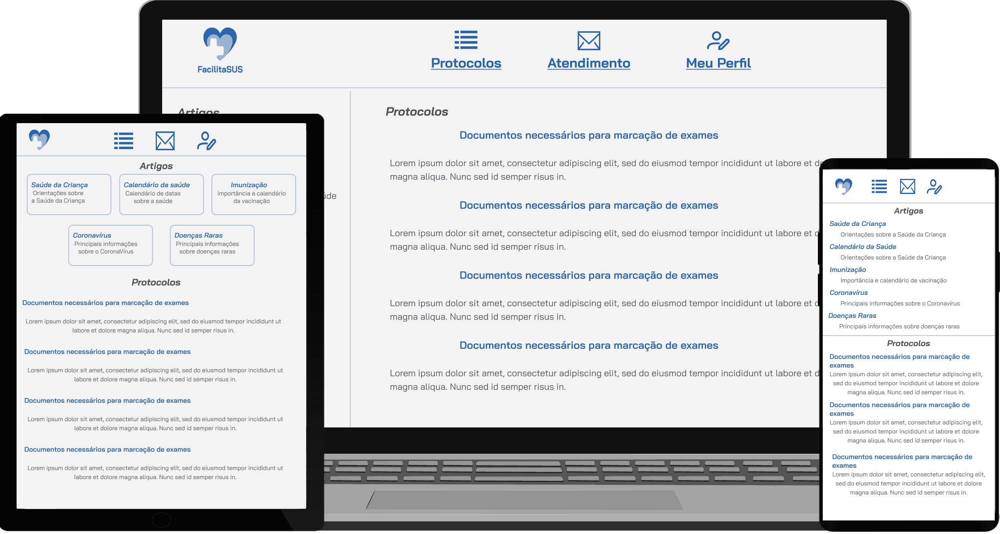

<h1 align="center">
  <a href="https://icei-puc-minas-pmv-si.github.io/pmv-si-2023-2-pe1-t3-facilitasus/src/LoginPage.html" target="_blank"> FacilitaSUS </a>
</h1>

 Para experimentar o FacilitaSUS, visite nossa aplicação no link acima.
  

  
  
  
   
  <a href="#-tecnologias">Tecnologias</a>&nbsp;&nbsp;&nbsp;|&nbsp;&nbsp;&nbsp;
  <a href="#-projeto">Projeto</a>&nbsp;&nbsp;&nbsp;|&nbsp;&nbsp;&nbsp;
  <a href="#-puc">PUC</a>&nbsp;&nbsp;&nbsp;|&nbsp;&nbsp;&nbsp;
  <a href="#-layout"> Layout </a>&nbsp;&nbsp;&nbsp;|&nbsp;&nbsp;&nbsp;
  

 

## 🚀 Tecnologias
Esse projeto foi feito com as seguintes tecnologias:

💻 Code
- HTML
- CSS
- JS

🎨 Design
- Figma
- Mockups
- SVG Icons

## 💻 Projeto
O projeto "FacilitaSUS" foi desenvolvido com o objetivo principal de eliminar burocracias e atrasos, proporcionando aos pacientes uma maneira mais rápida e eficiente de marcar exames e consultas médicas. A iniciativa concentra-se em fornecer um serviço de saúde mais acessível e conveniente, reduzindo a papelada e os processos morosos que muitas vezes impedem os pacientes de obterem os cuidados de que precisam.

## 🎓 PUC
Este projeto foi desenvolvido como parte da graduação em Sistemas da Informação na Pontifícia Universidade Católica (PUC). A PUC é uma instituição renomada que proporciona uma formação acadêmica sólida e abrangente. A ênfase no curso de Sistemas da Informação na PUC inclui a aplicação prática de conhecimentos teóricos para abordar desafios do mundo real.
Os estudantes envolvidos no projeto "FacilitaSUS" puderam aplicar e aprimorar habilidades técnicas, como programação, design de sistemas e gerenciamento de projetos. Além disso, a formação na PUC enfatiza a importância da inovação e da aplicação de tecnologia para resolver problemas significativos na sociedade.
 
 ## 🎨 Layout
 Você pode visualizar o Layout [Nesse Link](https://www.figma.com/file/qVLRaus8FdALBh34dFuDs3/Sus?type=design&node-id=0%3A1&mode=design&t=oe1XnUmfo3n7xGqp-1). Você precisa de conta do [Figma](http://figma.com/) para vê-lo.
 
